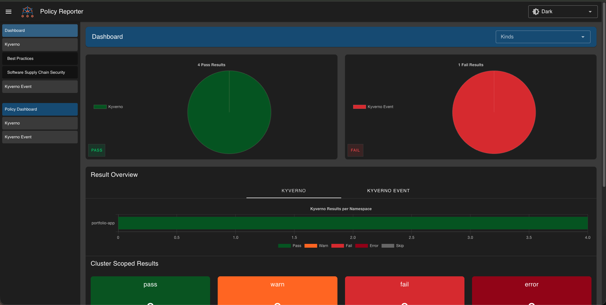

I was recently catching up on some of the tooling I worked with during my Co-op at Radius as a DevOps engineer, and I came across an article about securing Kubernetes deployments with Kyverno and Cosign. It clicked immediately. I’d used Kyverno for policy enforcement at work, but I’d never used it for container image signing and verification.

That sent me down a rabbit hole. I wanted to prove, mostly to myself, that a cluster can refuse to run anything that didn’t come from a trusted CI pipeline, even if the image tag _looks_ fine.

## The Problem

When you deploy software to Kubernetes, you tell the cluster to pull a container image from a registry, something like `docker.io/mycompany/myapp:v2.1.0`. By default, the cluster trusts that image blindly. It can’t really tell whether the image was built by your CI pipeline, or whether something changed after it was pushed.

That’s the supply chain gap: the registry sits between your build pipeline and your cluster. Without some cryptographic proof, it’s a weak link. An image can be altered, replaced, or pushed outside your pipeline while still looking “normal” to Kubernetes.

So the question I built this project around was: **how can a Kubernetes cluster verify that the image it’s about to run was built by the trusted CI identity and hasn’t been tampered with?**

## Why I Cared About This

During my internship at Radius, I worked with Kyverno for policy-as-code enforcement: requiring resource limits on pods, enforcing labels, and blocking privileged containers. I also worked with GitOps pipelines, ArgoCD, Kargo, NetworkPolicies, and mTLS with cert-manager. All of that was about hardening how things run in the cluster.

But supply chain security is about what _enters_ the cluster in the first place. When I read about using Kyverno's `verifyImages` feature combined with Cosign's keyless signing, I realized it was the missing piece. It was right in my wheelhouse. I'd used the policy engine, just never for this particular use case.

So I built a project that demonstrates the full flow: build an image, sign it cryptographically, generate an SBOM, and enforce all of it at the cluster admission layer.

## What I Built

The project lives in a single repo: [k8s-supply-chain-security](https://github.com/amoghjay/k8s-supply-chain-security). The “app” in this demo is actually my portfolio website that I’m building. The goal here wasn’t the app logic itself, but the supply-chain guardrails around it: CI signing, SBOM attestation, and admission-time enforcement.

### The Pipeline

The GitHub Actions workflow does the following on every tagged release:

1. **Build** the Docker image from the Dockerfile.
2. **Push** it to Docker Hub: `amoghjay1908/k8s-supply-chain-demo`.
3. **Sign** it with Cosign using keyless mode, through OIDC via GitHub Actions, with no private keys to manage.
4. **Generate an SBOM** with Syft, as a CycloneDX Software Bill of Materials listing every package in the image.
5. **Attest the SBOM** with Cosign, wrapping the SBOM in a signed in-toto attestation and pushing it to the registry.

Every step after the build operates on the image's **digest**, not its tag. This is important. Tags are mutable. `:v1.0.0` can be reassigned to a different image. Digests are immutable. The signature is cryptographically bound to the exact image content.

### The Policies

On the cluster side, I applied three Kyverno ClusterPolicies.

**1. Require signed images:** Any pod in the `portfolio-app` namespace must use an image signed by my GitHub Actions workflow. Kyverno checks the Cosign signature, verifies the OIDC identity, issuer and subject, and confirms the signature is recorded in Sigstore's Rekor transparency log. If the signature is missing or the identity doesn't match, the pod is rejected at admission time before it ever reaches the scheduler.

**2. Disallow `:latest` tag:** This blocks any pod that uses the `:latest` tag or no tag at all. It reinforces the signing model. If you sign by digest but deploy by a mutable tag, the guarantee is weakened. Forcing explicit version tags keeps the reference stable.

**3. Require SBOM attestation:** Beyond just checking the signature, this policy requires that the image has a signed CycloneDX SBOM attestation. This extends trust from "who built it?" to "what's inside it?" The cluster won't run an image unless it can verify both the builder's identity and the contents inventory.

### The Dashboard

I added Policy Reporter with the Kyverno plugin, which provides a web UI showing every policy pass, fail, and blocked resource.

One thing I ran into: Kyverno's Enforce mode blocks pods at admission but doesn't create PolicyReport resources by default. Those are only generated for Audit mode and background scans. The Kyverno plugin solves this by watching Kubernetes Events that Kyverno emits when a resource is blocked, and turning those into PolicyReports.

The key was enabling `blockReports` in the Helm config:

```bash
helm upgrade --install policy-reporter policy-reporter/policy-reporter \
  --create-namespace -n policy-reporter \
  --set ui.enabled=true \
  --set plugin.kyverno.enabled=true \
  --set plugin.kyverno.blockReports.enabled=true \
  --set plugin.kyverno.blockReports.eventNamespace=default \
  --set ui.plugins.kyverno=true
```

Without `blockReports.enabled=true`, the dashboard stays empty even though pods are being rejected.



## What Happens In Practice

Here's the demo in action:

```bash
kubectl run test-latest --image=nginx:latest -n portfolio-app
# BLOCKED: "Using a mutable image tag e.g. 'latest' is not allowed."

kubectl run test-unsigned --image=amoghjay1908/k8s-supply-chain-demo:unsigned -n portfolio-app
# BLOCKED: "no signatures found"

kubectl apply -f manifests/signed-pod.yaml
# PASSES: image is signed, SBOM attested, tag is explicit
# pod/signed created
```

The cluster only runs what was built, signed, and attested by the trusted pipeline. Everything else is rejected before it starts.

## The Keyless Signing Model

I had to re-learn this part, because “keyless” sounds like marketing until you see what’s actually happening. It doesn’t mean unsigned. It means you aren’t babysitting a long-lived private key.

With traditional signing, you generate a keypair, protect the private key, rotate it, and make sure verifiers have the right public key. It works, but in CI it turns into “yet another secret” to manage.

Cosign’s keyless mode is the first approach that felt operationally realistic for demos _and_ real pipelines. During a GitHub Actions run, Cosign uses the workflow’s OIDC token to request a short-lived certificate from **Fulcio**. That cert is valid for a few minutes. It is just long enough to sign the image. Then the signature gets recorded in **Rekor**, Sigstore’s transparency log.

So you get strong identity binding, meaning which repo and workflow produced the image, without turning signing into a secrets-management project.

On the verification side, Kyverno checks:

- Is there a valid Cosign signature for this image?
- Was the signing certificate issued by Fulcio with the expected OIDC issuer, `token.actions.githubusercontent.com`?
- Does the subject match the expected GitHub repository, `github.com/amoghjay/`?
- Is the signature recorded in Rekor?

If all checks pass, the pod is admitted. Otherwise, it's rejected.

## SBOMs: Why "What's Inside" Matters

Signing answers "who built this?" But it doesn't tell you anything about the image's contents. A signed image could still contain vulnerable packages or unexpected dependencies.

That's where the SBOM, or Software Bill of Materials, comes in. Syft scans the built image and produces a CycloneDX JSON document listing every OS package, language dependency, and library inside the container. Cosign then wraps this SBOM in a signed attestation and pushes it to the registry.

On the cluster side, the Kyverno policy doesn't just check that the SBOM _exists_. It verifies that the SBOM attestation was signed by the same trusted CI identity and recorded in Rekor. This means the cluster can trust not only the image's provenance but also its contents inventory.

In a production environment, you could go further: write policies that inspect the SBOM and block images containing specific vulnerable packages. For this demo, enforcing the SBOM's presence is the key point. It proves the concept and establishes the verification chain.

## What I Learned Along The Way

A few things that weren’t obvious from the documentation, or at least weren’t obvious to me:

**SBOM predicate types matter.** Syft generates CycloneDX with predicate type `https://cyclonedx.org/bom`, but some Kyverno policy examples use `https://cyclonedx.org/schema`. If there’s a mismatch, attestation verification can fail without a very obvious error. I ended up checking the predicate type from the real attestation output with `cosign verify-attestation` before locking in the policy.

**Policy Reporter needs explicit config for Enforce mode.** The first time I set it up, I thought I’d broken something because the UI stayed empty even while Kyverno was actively blocking pods. Enforce blocks requests _before_ they become resources, so the normal reporting path doesn’t have anything to pick up. Enabling `blockReports` through the Kyverno plugin fixed it.

**Cosign and Kyverno failures aren’t always friendly.** When verification didn’t match, I sometimes got a “no signatures found” style message even though I _thought_ I signed the image. In practice, the fastest way to debug was to verify by digest and inspect the exact identity claims Kyverno was checking.

**Multi-arch builds need attention.** If you're on Apple Silicon, your local `docker build` produces an `arm64` image by default. The GitHub Actions workflow should include `platforms: linux/amd64,linux/arm64` to build for both architectures. Otherwise, the image won't pull on most cloud clusters.

## What This Maps To

If you like maturity frameworks, here’s the rough mental model I used to map this to SLSA. I’m not claiming “SLSA compliance” here. I’m just showing which ideas each piece demonstrates:

| What's demonstrated | What it proves |
| --- | --- |
| Build in GitHub Actions, not locally | Build process is defined and hosted |
| Keyless signing with OIDC identity | Authenticated, non-forgeable provenance |
| Rekor transparency log entry | Immutable, public audit trail |
| SBOM attestation | Visibility into image contents |
| Kyverno enforcement at admission | Runtime trust boundary between CI and cluster |

## Tools Used

- **Cosign**: keyless container image signing and attestation.
- **Kyverno**: Kubernetes-native policy engine and admission controller.
- **Syft**: SBOM generation in CycloneDX format.
- **Policy Reporter**: a UI for Kyverno policy results.
- **GitHub Actions**: CI pipeline plus OIDC identity.
- **Rekor**: Sigstore transparency log.

## What I'd Add Next

This project is part of a broader set of platform engineering demos I'm building. Some natural extensions:

- **Vulnerability scan attestation**, using Trivy to scan the image and attest the results, then writing a Kyverno policy that blocks images with critical CVEs.
- **Registry restriction policy**, limiting which OCI registries are allowed at all, as a first layer before signature verification.
- **ArgoCD integration**, wiring this into a GitOps pipeline so image promotions across environments, dev to staging to prod, are also subject to these policies.

## Try It Yourself

The full project is at [github.com/amoghjay/k8s-supply-chain-security](https://github.com/amoghjay/k8s-supply-chain-security). The README walks through everything. It covers setting up the pipeline, installing Kyverno and the policies, and running the demo. There's also a pre-built signed image, `amoghjay1908/k8s-supply-chain-demo:v1.0.1`, that you can use to test the cluster-side enforcement without running the CI pipeline yourself.

If you're already using Kyverno for policy enforcement, adding `verifyImages` rules is a small step that significantly strengthens your supply chain posture. If you're not using Kyverno yet, this is a good reason to start.
