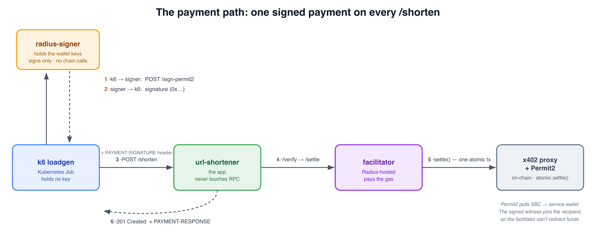
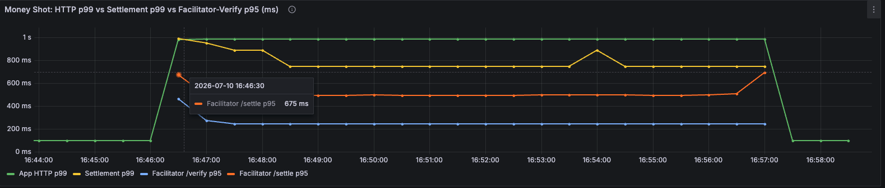

Part 1 left me with a promotion pipeline I trusted to gate on more than "is the pod running."
Before adding the chaos injections for Part 3, I needed the traffic driving that gate to be
real too.

The app charges testnet tokens to shorten a URL. The tokens have no real-world value, but the
signature, verification, and on-chain settlement are real. I first built the payment path by
hand, then migrated it to x402. This post is about that migration and what it taught me.

*This is Part 2 of three. [Part 1](/blog/my-gitops-wasn-t-gating-anything/) is the platform:
GitOps, Helm, secrets, and the promotion pipeline. This part is how the load test signs and
settles a payment on every request. Part 3 is the
payoff: a chaos gate that blocks a regression a normal health check waves straight through.*

---

## The Problem: A Load Test That Can't Fail the Right Way

The Part 3 gate rejects a release if the app cannot survive a failure underneath it. That
verdict only matters if the experiment exercises the path users actually take. Hammering
`/health`, or calling `POST /shorten` with payment stubbed out, only proves the web server
accepts connections.

Here, every iteration must produce a valid signature and settle with testnet tokens. "Generate
load" becomes "run a wallet that signs and settles a micropayment a few times a second from
inside the cluster."

**So the question for Part 2 is: how do you make a load generator complete a real payment flow
on every request without putting a private key anywhere it doesn't belong or letting payment
latency hide everything else you are trying to measure?**

## Why I Cared About Getting This Right

I'd worked around x402 and payments during my co-op at Radius, but only in pieces. I had never
stood up the complete path: a wallet signs, a facilitator settles on-chain, and the app reacts
to the result. This was my chance to do it end to end.

I had also taken a cryptocurrency and smart-contracts class that semester, so EIP-712 signing,
token allowances, and settlement were fresh. That grounding made x402 and Uniswap's Permit2
click much faster. It also pushed me to build a real payment path instead of bolting on a
throwaway FastAPI demo just to give the platform something to deploy.

The one rule I set early: **the private keys live in exactly one pod, and the load runner
never sees them.** That single constraint shaped the whole design, and it happens to mirror
how this works in a real system. Signing happens at the wallet, not at whatever is driving
traffic.

## The Cast: k6, a Signer, the App, and a Facilitator

Four things move on every payment. What matters is *which* box holds the key and *which* box
touches the chain:

- **k6** drives the loop but holds no key and never talks to the blockchain.
- **`radius-signer`**, a tiny FastAPI pod, is the one place the private keys exist. It signs a
  payment authorization when asked.
- **the app** (`url-shortener`) takes a signed payment in a header and gets it verified and
  settled before creating the short URL.
- **the facilitator**, a Radius-operated HTTP service, does the on-chain work, so the app
  itself never touches an RPC node.


*The payment path end to end. k6 asks the signer for a signature, sends it to the app as a header, and the app has the facilitator verify and settle it on-chain before the short URL exists.*

## What Happens on Every Request

The hot loop, once per iteration:

1. **k6 asks the signer to sign a payment.** `POST /sign-permit2` with a wallet index and an
   amount. The signer builds an EIP-712 payment authorization, signs it with that wallet's
   key, and returns the signature. No blockchain call happens in this request path.
2. **k6 sends the signature to the app.** It base64-encodes the authorization into a
   `PAYMENT-SIGNATURE` header and calls `POST /shorten` with just the URL in the body.
3. **The app verifies, then settles, through the facilitator.** It decodes the header, builds
   the payment requirements *from its own config* (so a client can't negotiate a cheaper
   price), and calls the facilitator's `/verify`, then `/settle`.
4. **The app returns 201** with the settlement details in a `PAYMENT-RESPONSE` header. k6 then
   follows the redirect to confirm the short URL actually works.

If verification or settlement fails, the app returns 402 and k6 records a failed payment. An
unreachable facilitator is tracked separately as a dependency error. That distinction matters
in Part 3 because "the payment dependency is down" and "the app is down" should look different.

On a clean staging run: **301 iterations, 100% payment success, end-to-end p95 ~700ms**. That is
roughly **2.5× faster** than the old path's ~1.8s.


*Every iteration signs and settles a testnet payment, and the app-perceived p95 sits well under a second (~675ms here). This is the number that made the migration worth it.*

## The Deep Dive: What a "Facilitator" Actually Does

"Facilitator" sounds like it is hiding something. Here is what it actually does.

In the old version, the client submitted a blockchain transaction and handed the app its hash.
The app then polled an RPC node, decoded the transfer event, and checked the amount and
recipient. That took a couple hundred lines of receipt-polling and put the app on the critical
path for every chain round-trip.

x402 flips who does the chain work. Instead of submitting a transaction, the client *signs an
authorization* saying "you may pull this exact amount of this token from my wallet to this
exact address." The facilitator is what turns that signature into a settled transaction. It
pays the gas, submits one transaction, and reports back. The app's job shrinks to sending the
signed payload and acting on the facilitator's structured response. It stops talking to an RPC
node entirely.

The mechanism underneath is Uniswap's **Permit2**, and the load-bearing detail is the
**witness**. The signature does more than authorize a transfer. It commits to a *destination*
baked into the signed message:

```python
# signer/permit2.py: the signed message. The witness pins the recipient.
message = {
    "permitted": {"token": SBC_CONTRACT, "amount": amount},
    "spender":   X402_PROXY,          # the canonical Permit2 proxy, not the facilitator
    "nonce":     nonce,               # a random 256-bit value, chosen client-side
    "deadline":  int(time.time()) + DEADLINE_SECONDS,
    "witness":   {"to": service_wallet, "validAfter": 0},   # <- destination is signed in
}
```

Because `witness.to` is signed and enforced by the on-chain proxy, **the facilitator can't
redirect the payment.** It can settle the payment or not, but it cannot change where the money
goes. "Let a hosted service settle my payments" sounded alarming until I traced that boundary
and saw the destination was pinned before the service received the signature.

Two more consequences fall out of this, and both are why the path got *faster*:

- **The nonce is random, not sequential.** Permit2 tracks spent authorizations in a bitmap, so
  the signer picks a random 256-bit nonce instead of reading the wallet's current nonce from
  the chain. That removes an RPC round-trip from the signing hot path. The crypto itself is
  sub-millisecond, and the whole `/sign-permit2` call sits around **~20ms p95** including the
  in-cluster HTTP hop. The old path had an on-chain round-trip here.
- **Settlement is a single atomic transaction.** The proxy validates the signature and pulls
  the tokens in one on-chain call, and the facilitator pays the gas. No two-step "approve then
  transfer" per payment, and nothing in the load path waits on a receipt the app has to poll.

There is one setup cost: each wallet must approve Permit2 before it can pull tokens. The signer
checks and creates that approval before the load test, keeping its only intentional RPC work
outside the request loop. The Radius facilitator then sponsors each settlement's gas.

## What I Learned Along the Way

### The facilitator says "200 OK" when your signature is invalid

I fed the facilitator a bad signature and expected an HTTP error. It returned **HTTP 200** with
`isValid: false`. Validity lives in the body, not the status line, so the app must parse
`isValid` before attempting settlement.

There was another observability trap here. The facilitator response separates
`invalidReason`, a machine-readable reason, from `invalidMessage`, the human-readable detail.
I still did not want an external response vocabulary becoming an unbounded Prometheus label,
so signature recovery failures are grouped into a coarse `signature_invalid` outcome. The
detailed reason is logged for a human to inspect.

### Replay protection wasn't where I thought it was

I expected the blockchain to catch replays: submit the same payment twice and the second
transaction reverts. Instead, the facilitator returned **`{"success": true}` with the original
transaction hash**. Its idempotency cache returns the first result without another on-chain
call, so the revert I expected never happens.

The observable replay guard is less glamorous: a `UNIQUE` constraint on the settlement hash
in Postgres. The cached hash violates that constraint on insert, which the app counts as a
replay attempt. Permit2 provides the cryptographic protection, but the app sees a database
constraint violation.

### I threw away the first working version on purpose

I had the payment path working against a third-party facilitator with EIP-2612. Then the
[Radius x402 integration guide](https://docs.radiustech.xyz/developer-resources/x402-integration/)
led me to its first-party Permit2 facilitator and **atomic single-transaction settlement**,
instead of the two transactions my original path needed. I deleted the working spike.

That felt wrong for about a day. But Permit2 removed the signer's per-request RPC call and a
whole failure mode: discovering a settlement wallet that could rotate. For a clean chaos
target, fewer moving parts on the hot path won. The dead spike is still in git history if I am
ever wrong about that.

## What the Payment Path Demonstrates

| What's demonstrated | What it proves |
|---|---|
| Load test signs + settles a testnet payment per iteration | The chaos gate in Part 3 exercises the app's actual request path, not a stub |
| Keys live only in `radius-signer`; k6 and the app never hold one | Secret boundary matches real x402 topology (sign at the wallet, not the load driver) |
| App verifies + settles via a facilitator, never touches RPC | A couple hundred lines of receipt-polling deleted; the app's payment code is a thin HTTP client |
| Witness pins the recipient in the signed message | A third-party facilitator settles the payment but can't redirect the funds |
| Random Permit2 nonce + atomic settlement | No hot-path RPC round-trip; end-to-end p95 dropped ~1.8s → ~700ms |
| Separate signer pod | Part 3 gets a distinct chaos target: "auth service down" is a different signature from "app down" |

## Where This Goes Next

In Part 3, I inject failures under this live payment load. Because every iteration is valid, a
passing gate means the *paying* path survived, not that the app returned 200s to empty requests.
The separate signer also becomes a third chaos target, with a failure signature distinct from
the app being down or the facilitator being slow.

The most reusable idea here, if you're load-testing anything with a real cost on the request
path: keep the credential in one process, have your load generator ask that process to
authorize each request, and measure the app against the same transaction your users actually
run. The full payment path, including the signer, app client, and load generator, is in the repo
if you want to pull it apart.

I wanted to build this instead of stopping at a diagram. It shows one practical x402
integration, from signing through settlement, and made me learn where the security and
operational boundaries sit. I think stablecoins will be part of the future of payments, and
it is not only crypto-native startups moving that way. [Visa is expanding USDC settlement](https://corporate.visa.com/en/sites/visa-perspectives/newsroom/visa-launches-stablecoin-settlement-in-the-united-states.html),
[Coinbase created x402](https://docs.cdp.coinbase.com/x402/welcome) to make stablecoin payments
work directly over HTTP, and [Stripe is expanding stablecoin acceptance and its Bridge
infrastructure](https://stripe.com/blog/everything-we-announced-at-sessions-2026). I do not know
where it all lands, but seeing companies at that scale build toward it made this feel like the
right thing to learn hands-on. I learned far more by building the path than I could have from
reading the protocol alone.

---

*The full project is at [github.com/amoghjay/k8s-chaos-promotion](https://github.com/amoghjay/k8s-chaos-promotion). The [Radius x402 integration guide](https://docs.radiustech.xyz/developer-resources/x402-integration/) and [facilitator API reference](https://docs.radiustech.xyz/developer-resources/x402-facilitator-api/) were the source of truth for the payment flow, Permit2 values, and facilitator endpoints.*
